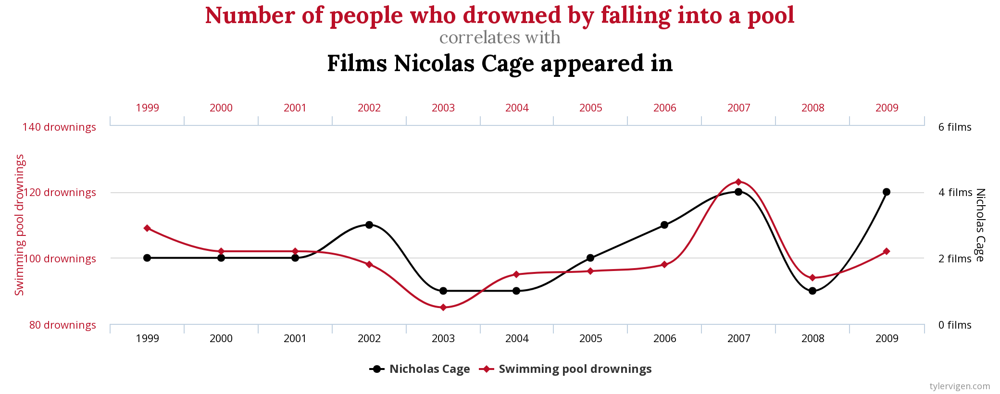
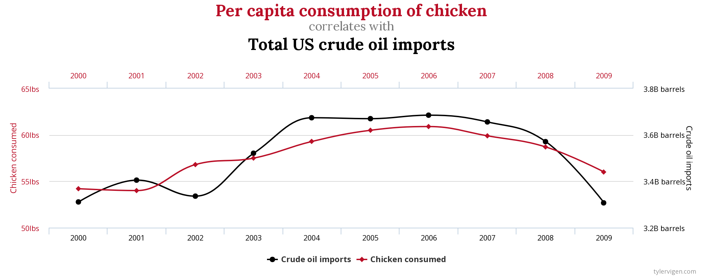
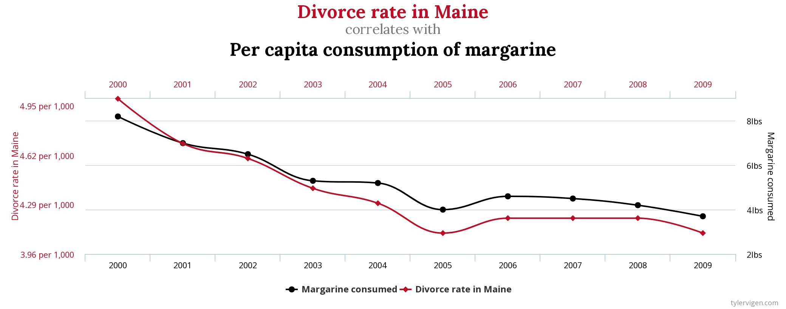
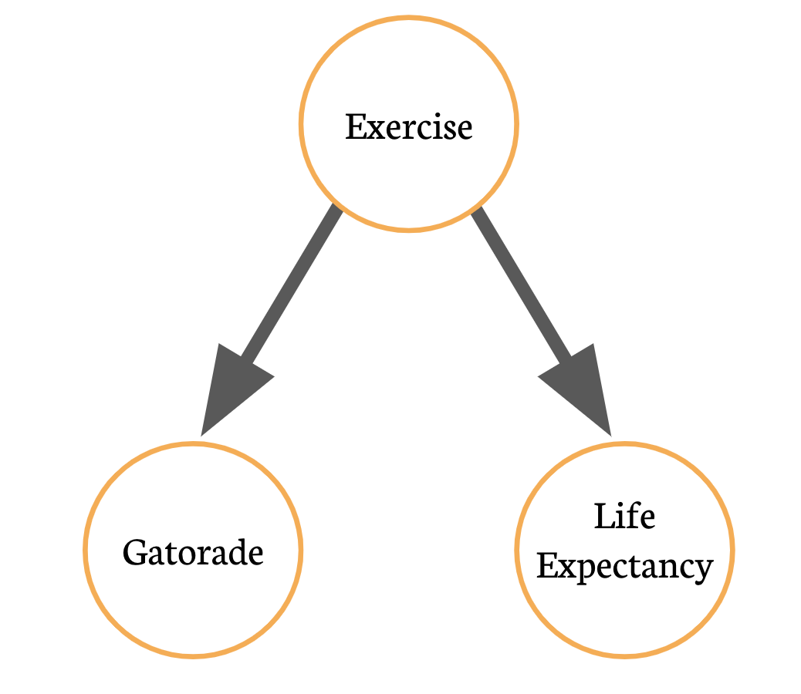

```{r setup, include=FALSE}
knitr::opts_chunk$set(echo = TRUE)
```

# 1. What is a relationship anyway?

You will often hear that two variables of some kind are "related," "linked," or "associated" in some way. What does this mean?

Well, we generally mean that the relationship between them is *predictable* in some way. For example:

```{r}
library(tidyverse)
library(patchwork)

p1 <- tibble(x = rnorm(1000, mean = 5, sd = 2),
       y = x + rnorm(1000, mean = 5, sd = 2)) %>%
  ggplot(aes(x, y)) + 
    geom_point() + 
    geom_smooth(method = "lm", col = "darkred") +
    theme_bw() + 
    labs(subtitle = "As x increases, y tends to increase too.")

p2 <- tibble(x = rnorm(1000, mean = 5, sd = 2),
       y = rnorm(1000, mean = 5, sd = 2) - x) %>%
  ggplot(aes(x, y)) + 
    geom_point() + 
    geom_smooth(method = "lm", col = "darkred") +
    theme_bw() + 
    labs(subtitle = "As x increases, y tends to decrease.")

p3 <- tibble(x = rnorm(1000, mean = 5, sd = 2),
       y = sin(x) + rnorm(1000, mean = 1, sd = 0.5)) %>%
  ggplot(aes(x, y)) + 
    geom_point() + 
    geom_smooth(col = "darkred") +
    theme_bw() + 
    labs(subtitle = "As x increases, y changes in non-linear way.")

p4 <- tibble(x = rnorm(1000, mean = 2, sd = 2),
       y = x^3 + rnorm(1000, mean = 50, sd = 25)) %>%
  ggplot(aes(x, y)) + 
    geom_point() + 
    geom_smooth(col = "darkred") +
    theme_bw() + 
    labs(subtitle = "As x increases, y increases non-linearly.")

p5 <- tibble(x = rnorm(1000, mean = 5, sd = 2),
             y = rnorm(1000, mean = 5, sd = 2)) %>%
  ggplot(aes(x, y)) + 
    geom_point() + 
    geom_smooth(method = "lm", col = "darkred") + 
    theme_bw() + 
    labs(subtitle = "No clear relationship between x and y.")

(p1 + p2) / (p3 + p4)
p5
```

# 2. Correlation vs. Causation

In scientific research (and for your final project), we are often interested in the relationship between several variables. For example, smoking and cancer or school funding and student outcomes.

However, **just because we observe a clear relationship between two variables does not mean that they are causally related**.

That is, **correlation is not causation**. This mistake can be very tempting when conducting your own analyses. However, some silly examples make it clear. Here are 3 from a website called Spurious Correlations[^1]:

[^1]: Examples from [the following site](https://www.tylervigen.com/spurious-correlations).

```{r}



```

Often, seeming relationships will actually be caused by **confounders**. A **confounding** variable is one that is causally related to both your "explanatory" and "dependent" variables.[^2] 

[^2]: For a reminder of what these terms mean, revisit [the final project instructions](https://rpubs.com/tylersimko/project).

This diagram is one way to visualize confounding. There may be no true relationship between **X** and **Y**, but a third variable **Z** can be causing ***both*** **X** and **Y**.

For example, imagine you notice that people who **drink more bottles of Gatorade per week** tend to **live longer**. You get hired by *Gatorade* to publish some beautiful plots made in R. The company CEO asks you - "There is a clear relationship between the number of pairs of running shoes a person owns and the number of years that they live. Is this causal?"

After taking this course, you should be prepared to say **no**! This is a case of confounding. In this situation, **exercise** is related to both drinking Gatorade and Life Expectancy.

```{r, out.width="50%", fig.align="center"}

```

# 3. Controlling for Variables

You may have heard about "controlling" for a variable. Typically, controlling is done with a statistical model. These are beyond the scope of this course (although please ask me if you are interested!), but we can still understand conceptually what is happening when a variable is controlled for.

In the plot below, we see a clear upward trend between the number of Gatorades drunk per week and life expectancy. This is a potential relationship between two variables:

```{r}
set.seed(80)
x <- tibble(exercise = rnorm(10000, mean = 40, sd = 8),
            gatorade  = rbinom(10000, size = 10, 
                               prob = (exercise / max(exercise)) - 0.3 + 
                                 rnorm(10000, mean = 0.2, sd = 0.01)),
       years = rnorm(10000, 70, sd = 6) + exercise / 4)
q <- quantile(x$exercise, probs = c(0.25, 0.5, 0.75, 1.0))

x %>% 
  ggplot(aes(x = gatorade, y = years, group = gatorade)) + 
  geom_boxplot() +
  geom_smooth(data = x, 
              aes(x = gatorade, y = years, group = 1),
              col = "darkred") + 
  labs(title = "Potential relationship between Gatorade and Life Expectancy",
       x = "# of Gatorades / week",
       y = "Years Lived") + 
  scale_x_continuous(breaks = 0:10, 
                     labels = 0:10 %>% as.character()) + 
  theme_bw()
```

However, what happens if we "control" for exercise? Well, in principle this means we want to ensure that **we only compare people who exercise at similar rates**. We can do that with plotting techniques that we already know:

```{r}
x <- x %>%
  mutate(income_label = case_when(exercise <= q[1] ~ "No Exercise",
                                  exercise <= q[2] ~ "Some Exercise",
                                  exercise <= q[3] ~ "Above Avg. Exercise",
                                  exercise <= q[4] ~ "Fitness Fanatics"),
         income_label = factor(income_label, levels = c("No Exercise",
                                                        "Some Exercise",
                                                        "Above Avg. Exercise", 
                                                        "Fitness Fanatics")))

x %>% ggplot(aes(gatorade, years)) + 
  geom_jitter() + 
  geom_smooth(col = "darkred", method = "loess") +
  theme_bw() + 
  facet_wrap(~income_label, nrow = 1) + 
  labs(subtitle = "Adjusting for a confounder can breakdown spurious correlations.",
       x = "# of Gatorade / Week",
       y = "Years Lived") + 
  theme_bw()

```

Once we "control" for exercise by only comparing people who exercise at similar rates, the relationships between Gatorade and Life Expectancy within each group (the red lines) are essentially flat. 

### Exercises

1. Mistaking correlations for causation is one of the most common mistakes made in the social sciences. For your project, think of a plausible relationship between two variables. Use your dataset and create a plot with the relationship.

```{r}

```

2. Now, try to think of a possible confounder in this relationship. Is there a variable that could be causing both your treatment **and** your outcome?

<div class="tocify-extend-page" data-unique="tocify-extend-page" style="height: 0;"></div>